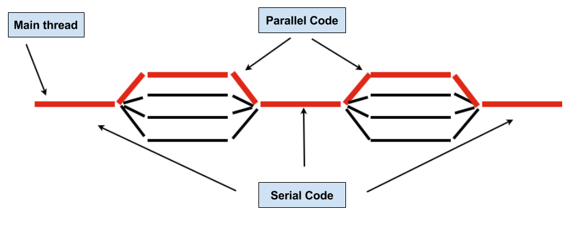

This topic is a simply refresher to some concepts we need to understand when talking about parallel programming.

### Task Types

There are two main types of software:

1. Serial
2. Parallel

Serial software is simple as it executes only one instruction at a time. More precisely, it is one thread running in one process. When talking about parallel software, we mean that multiple instructions can run at the same time, doing the same or different work. It involves multiple threads or processes, depending on the technique used.

### Parallelism Concepts

#### Programming Models

##### Shared Memory

This is when parallel software tasks communicate with each other using shared memory. This is mainly used with threads, although processes can communicate with each other using shared memory if they are on the same machine.

Note that:

* Each parallel portion execute the same copy of the code.
* Each thread has access to the same memory region.

##### Distributed Memory

This is when each task has its own memory space. This is for separate processes that can be (or not) on the same machine.

Note that:

* Each parallel portion execute their own copy of the code.
* Each process has access to its own memory only.
* Communication is done via shared-memory or network operations.

#### Race Condition

Race conditions arise in software when an application depends on the sequence or timing of processes or threads for it to operate properly.

Source: [Wikipedia](https://en.wikipedia.org/wiki/Race_condition#Software)

#### Efficiency

Efficiency is the speedup that can be measured by adding more computing resources (threads or processes).

Source: [Wikipedia](https://en.wikipedia.org/wiki/Speedup)

